# KCA System Architecture

> **View / edit the diagram live:**
> Paste the Mermaid block below into **[mermaid.live](https://mermaid.live)** or any Mermaid-compatible renderer (GitHub, VS Code Markdown Preview Enhanced, Notion, Confluence).

```mermaid
graph TB
    %% ── Client ──────────────────────────────────────────────────
    USER(["👤 Browser"])

    %% ── Frontend ─────────────────────────────────────────────────
    subgraph FE["Frontend  ·  Next.js 16 / React 19 / Tailwind  (port 3000)"]
        LANDING["🏠 Landing Page
        Project list · Search · Detail modal"]
        PREDICT_UI["🚀 Predict Page
        Campaign form · Result · Similar projects"]
    end

    %% ── ML API ───────────────────────────────────────────────────
    subgraph API["ML Backend API  ·  FastAPI / Python 3.10  (port 8000)"]
        direction TB

        subgraph BROWSE["Browse"]
            PROJECTS["/projects  paginated list"]
            SEARCH["/search  HNSW semantic
            lru_cache 256 on embed"]
            STATS["/stats/categories
            /stats/predictions"]
            META["/metadata
            /metadata/main-categories"]
        end

        subgraph INFER["Inference"]
            PREDICT["/predict  sync + async
            ✅ Redis cache DB 2"]
            RECOMMEND["/recommend  HNSW re-score"]
        end

        subgraph OPS["Operations"]
            RETRAIN["/admin/retrain  enqueue job"]
            JOBS["/jobs/{task_id}  poll status"]
        end

        EMBEDDER(["SentenceTransformer
        all-MiniLM-L6-v2
        shared · loaded once"])
        CATBOOST(["CatBoost Classifier
        + SHAP Explainer
        + Feature Pipeline"])
    end

    %% ── Celery Worker ────────────────────────────────────────────
    subgraph QUEUE["Task Queue  ·  Celery 5.4"]
        WORKER["⚙️ Celery Worker
        async predict · retrain"]
    end

    %% ── Storage ──────────────────────────────────────────────────
    subgraph STORE["Data Layer"]
        PG[("🐘 PostgreSQL 15 + pgvector
        ──────────────────
        projects  229 k rows
          text_embedding vector 384
        categories  FK normalisation
        prediction_log  drift audit
        category_stats  mat. view
        ──────────────────
        HNSW  text_embedding m=16
        B-tree  category · state
        port 5432")]

        subgraph REDIS_BOX["Redis 7  (port 6379)"]
            RDB0[("DB 0
            Celery broker")]
            RDB1[("DB 1
            Task results")]
            RDB2[("DB 2
            Predict cache
            TTL 24 h")]
        end

        MLFLOW[("📊 MLflow 2.13
        ──────────────────
        SQLite — run metadata
        /artifacts — model bins
        port 5001")]
    end

    %% ── Edges ────────────────────────────────────────────────────

    %% Client → Frontend
    USER -->|HTTP| LANDING
    USER -->|HTTP| PREDICT_UI

    %% Frontend → API
    LANDING -->|"GET /projects
    GET /search"| BROWSE
    PREDICT_UI -->|"POST /predict
    POST /recommend"| INFER
    PREDICT_UI -->|"POST /retrain
    GET /jobs"| OPS

    %% Search & Recommend → Embedder → DB
    SEARCH -->|encode query| EMBEDDER
    RECOMMEND -->|encode campaign| EMBEDDER
    EMBEDDER -->|"HNSW ⟨cosine⟩"| PG

    %% Predict → Cache → CatBoost → DB
    PREDICT -->|"1 cache check"| RDB2
    RDB2 -.->|"HIT: return cached"| PREDICT
    PREDICT -->|"2 MISS: run inference"| CATBOOST
    CATBOOST -->|"read features
    write prediction_log"| PG
    PREDICT -->|"3 cache set"| RDB2

    %% Stats & metadata
    STATS -->|SELECT category_stats| PG
    META -->|SELECT categories| PG
    PROJECTS -->|SELECT projects| PG

    %% Async predict path (Celery)
    PREDICT -->|"async_mode=true
    enqueue task"| RDB0
    RDB0 -->|dequeue| WORKER
    WORKER -->|"cache check/set
    same as sync path"| RDB2
    WORKER -->|store result| RDB1
    JOBS -->|fetch result| RDB1

    %% Retrain path
    RETRAIN -->|enqueue retrain| RDB0
    WORKER -->|load training data| PG
    WORKER -->|"log run + save model
    quality gate AUC≥0.65 F1≥0.55"| MLFLOW
    WORKER -->|"flush cache
    on gate PASS"| RDB2

    %% ── Styles ───────────────────────────────────────────────────
    classDef user     fill:#4A90D9,stroke:#2C5F8A,color:#fff
    classDef fe       fill:#6C5CE7,stroke:#4A3AA8,color:#fff
    classDef api      fill:#00B894,stroke:#007A63,color:#fff
    classDef worker   fill:#FDCB6E,stroke:#C9A140,color:#333
    classDef db       fill:#E17055,stroke:#A84F37,color:#fff
    classDef cache    fill:#D63031,stroke:#A0221E,color:#fff

    class USER user
    class LANDING,PREDICT_UI fe
    class PROJECTS,SEARCH,STATS,META,PREDICT,RECOMMEND,RETRAIN,JOBS,EMBEDDER,CATBOOST api
    class WORKER worker
    class PG,RDB0,RDB1,MLFLOW db
    class RDB2 cache
```



---

## Request Flows

### 1 — Semantic Search
```
Browser  →  Next.js  (400ms debounce or button)
         →  GET /api/v1/search?q=...&page=1&limit=12

FastAPI:
  lru_cache(256): same query string? → return cached vector (skip model)
  else: SentenceTransformer.encode(query)       ~20 ms
  → pgvector HNSW cosine search (text_embedding <=>)   ~5 ms
  → paginate top-120 in Python
  → return { success, data[], pagination }
```

### 2 — Synchronous Prediction  *(with Redis cache)*
```
Browser  →  POST /api/v1/predict

FastAPI:
  key = SHA-256(sorted payload)[:16]
  ┌─ Redis DB 2 HIT  →  return cached result immediately   ~11 ms
  └─ Redis DB 2 MISS
       → build_features (50+ engineered features)
       → CatBoost inference    prob_success, is_viable
       → CatBoost SHAP         top-5 feature impacts
       → category_stats lookup success_rate, median_goal, competition tier
       → write prediction_log  → PostgreSQL
       → cache.set(key, result, ttl=24h)
       → return enriched result                           ~200 ms
```

### 3 — Asynchronous Prediction  *(Celery + cache)*
```
Browser  →  POST /api/v1/predict?async_mode=true
         →  FastAPI enqueues task  →  Redis DB 0
         →  return { task_id }

Browser polls GET /api/v1/jobs/{task_id}  →  Redis DB 1

Celery Worker (predict_campaign_task):
  key = SHA-256(sorted payload)[:16]
  ┌─ Redis DB 2 HIT  →  store cached result in DB 1  (fast)
  └─ Redis DB 2 MISS →  full inference (same as sync path above)
                      →  cache.set + store in DB 1
```

### 4 — Similar Campaign Recommendations
```
Browser  →  POST /api/v1/recommend

FastAPI:
  sentence = "{name}. A {main_category} Kickstarter project in the
              {category} subcategory, with a ${goal_usd:,.0f} funding
              goal and a {duration_days}-day campaign."
  → SentenceTransformer.encode(sentence)   →  384-dim vector
  → pgvector HNSW fetch top-100 by cosine distance
  → re-score:  0.6 × cosine_sim + 0.2 × category_match + 0.2 × prior
  → return top-k sorted by score
```

### 5 — Asynchronous Retraining  *(MLOps)*
```
Browser  →  POST /api/v1/admin/retrain
         →  FastAPI enqueues Celery task  →  Redis DB 0
         →  return { task_id }

Browser polls GET /api/v1/jobs/{task_id}  →  Redis DB 1

Celery Worker (retrain_task):
  → load all projects from PostgreSQL
  → feature engineering (50+ features)
  → train CatBoost model
  → quality gate:
      AUC ≥ 0.65  AND  F1 ≥ 0.55
      ├─ PASS  →  save model artifact
      │          →  log run + metrics  →  MLflow
      │          →  cache.flush()  (Redis DB 2 wiped — new model, stale predictions)
      └─ FAIL  →  keep current model, log failed run
  → store result  →  Redis DB 1
```

---

## Embedding Design

All vector search — both `/search` and `/recommend` — uses **one column: `text_embedding vector(384)`**.

**Ingest-time template** (run by `recompute_text_embs.py`):
```
"{name}. A {main_category} Kickstarter project in the {category} subcategory,
 with a ${goal_usd:,.0f} funding goal and a {duration_days}-day campaign."
```

**Query-time:**

| Endpoint | Input | How embedded |
|---|---|---|
| `/search` | raw text query | embed as-is |
| `/recommend` | full campaign form | same sentence template |

Both queries hit the same HNSW index — no separate struct/text split.
To regenerate: `docker exec kca-ml-api python3 /tmp/recompute_text_embs.py`

---

## Predict Cache Design

| Property | Value |
|---|---|
| Store | Redis DB 2 (separate from Celery broker DB 0 and results DB 1) |
| Key | `predict:` + SHA-256(sorted JSON payload)[:16] |
| TTL | 24 hours (configurable via `PREDICT_CACHE_TTL` env) |
| Invalidation | `cache.flush()` called automatically after quality-gate PASS in retrain |
| Degradation | If Redis unavailable, silently skips cache — API continues serving |
| Coverage | Sync `/predict` + async Celery `predict_campaign_task` |
| Observed speedup | ~200 ms (MISS) → ~11 ms (HIT) |

---

## Frontend Components

| Page | Component | Responsibility |
|---|---|---|
| `/` | `HeroSection` | Search box — 400ms debounce + button/Enter submit |
| `/` | `ProjectGrid` + `ProjectRow` | Paginated project table with stable keys |
| `/` | `ProjectDetailModal` | Category benchmarks + "Use as Template" CTA |
| `/` | `ActionMenu` | Link to predictor |
| `/predict` | `PredictForm` | Campaign form — pre-fills from `?category=&goal_usd=&duration_days=` |
| `/predict` | `PredictResult` | Score · SHAP bars · category stats · competition badge |
| `/predict` | `SimilarProjects` | Recommendation cards from `/recommend` |

---

## Services & Ports

| Service | Stack | Port | Purpose |
|---|---|---|---|
| `frontend` | Node 20 / Next.js 16 | 3000 | Web UI |
| `kca-ml-api` | Python 3.10 / FastAPI | 8000 | REST API + ML inference |
| `kca-ml-worker` | Python 3.10 / Celery 5.4 | — | Async predict + retrain |
| `kca-postgres` | PostgreSQL 15 + pgvector | 5432 | Primary data store + vector DB |
| `kca-redis` | Redis 7 alpine | 6379 | DB 0 broker · DB 1 results · DB 2 predict cache |
| `kca-mlflow` | MLflow 2.13 | 5001 | Experiment tracking + model registry |

---

## Key Data Stores

| Store | Type | Detail |
|---|---|---|
| `projects` | Table | 229 k+ rows; `text_embedding vector(384)` unified sentence vector |
| `categories` | Table | FK normalisation; `main_category` field |
| `prediction_log` | Table | Every `/predict` call — feeds drift monitoring |
| `category_stats` | Materialized View | Pre-aggregated success rates, median goals, avg durations |
| HNSW on `text_embedding` | pgvector index | `m=16, ef_construction=64` — sub-10 ms cosine search on 229 k rows |
| Redis DB 0 | Celery broker | Task queue |
| Redis DB 1 | Celery results | TTL-based result storage |
| Redis DB 2 | Predict cache | `predict:<sha256>` keys · TTL 24 h · flushed after retrain |
| MLflow artifacts | File store | CatBoost binaries under `/mlflow/artifacts` |

---

## ML Models Loaded at API Startup

| Model | File | Used by |
|---|---|---|
| CatBoost classifier | `kca_classifier_v2.pkl` | `/predict` |
| Feature pipeline artifacts | `pipeline_artifacts.pkl` | `/predict` |
| SentenceTransformer `all-MiniLM-L6-v2` | HuggingFace (cached) | `/search`, `/recommend` |
