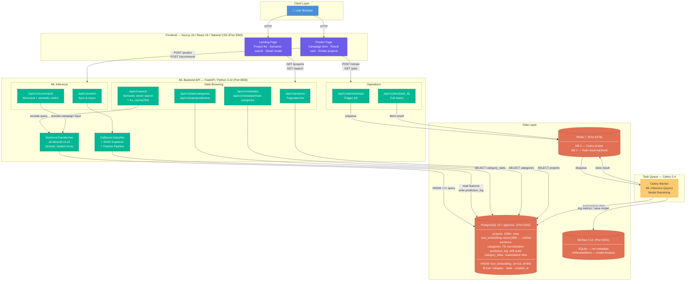

# KCA System Architecture



---

## Request Flows

### 1 — Semantic Search (Landing page search box)
```
Browser → Next.js (400ms debounce or button click)
  → GET /api/v1/search?q=...&page=1&limit=12

FastAPI:
  lru_cache(256): if query seen before → skip model, return cached vector
  else: SentenceTransformer.encode(query)  ~20ms
  → pgvector HNSW cosine search (text_embedding <=>)  ~5ms
  → paginate top-120 results in Python
  → return ProjectsResponse (same shape as /projects)
```

### 2 — Synchronous Prediction
```
Browser → Next.js → POST /api/v1/predict

FastAPI:
  → Feature engineering (build_features)
  → CatBoost inference  →  prob_success, is_viable
  → CatBoost native SHAP  →  top-5 feature impacts
  → category_stats lookup  →  success_rate, median_goal, competition
  → write prediction_log → PostgreSQL
  → return enriched result
```

### 3 — Similar Campaign Recommendations
```
Browser → Next.js → POST /api/v1/recommend

FastAPI:
  → Build canonical sentence:
      "{name}. A {main_category} Kickstarter project in the {category}
       subcategory, with a ${goal_usd} funding goal and a {duration_days}-day
       campaign."
  → SentenceTransformer.encode(sentence)  →  384-dim query vector
  → pgvector HNSW fetch top-100 by cosine distance
  → re-score each result:
      score = 0.6 × cosine_sim + 0.2 × category_match + 0.2 × category_prior
  → return top-k sorted by score
```

### 4 — Asynchronous Retraining (MLOps)
```
Browser → POST /api/v1/admin/retrain
  → FastAPI enqueues Celery task → Redis DB 0
  → return { task_id }

Browser polls GET /api/v1/jobs/{task_id}
  → Redis DB 1 returns { status, result }

Celery Worker:
  → Load all projects from PostgreSQL
  → Feature engineering (50+ features)
  → Train CatBoost model
  → Quality gate: AUC ≥ 0.65  AND  F1 ≥ 0.55
      PASS → save model artifact + log run → MLflow
      FAIL → keep current model, log failed run
  → Write result → Redis DB 1
```

---

## Embedding Design

All vector search (both `/search` and `/recommend`) uses **one column: `text_embedding vector(384)`**.

Projects are embedded at ingest time using the canonical sentence template:

```
"{name}. A {main_category} Kickstarter project in the {category} subcategory,
 with a ${goal_usd:,.0f} funding goal and a {duration_days}-day campaign."
```

At query time:
- **`/search`**: raw query string is embedded and matched against `text_embedding`
- **`/recommend`**: user's campaign form data is converted with the same template and matched

Both use the same HNSW index — no separate struct/text split.
To regenerate embeddings: run `recompute_text_embs.py` inside the API container.

---

## Frontend Components

| Page | Component | Responsibility |
|---|---|---|
| `/` | `HeroSection` | Search box (400ms debounce + button) |
| `/` | `ProjectGrid` + `ProjectRow` | Paginated project table |
| `/` | `ProjectDetailModal` | Category benchmarks + "Use as Template" CTA |
| `/` | `ActionMenu` | Link to predictor |
| `/predict` | `PredictForm` | Campaign input form (pre-fills from URL params) |
| `/predict` | `PredictResult` | Score · SHAP bars · category stats · competition badge |
| `/predict` | `SimilarProjects` | Recommendation cards from `/recommend` |

---

## Services & Ports

| Service | Image / Stack | Port | Purpose |
|---|---|---|---|
| `frontend` | Node 20 / Next.js 16 | 3000 | Web UI |
| `kca-ml-api` | Python 3.10 / FastAPI | 8000 | REST API + ML inference |
| `kca-ml-worker` | Python 3.10 / Celery | — | Async task execution |
| `kca-postgres` | PostgreSQL 15 + pgvector | 5432 | Primary data store + vector DB |
| `kca-redis` | Redis 7 alpine | 6379 | Broker (DB 0) + results (DB 1) |
| `kca-mlflow` | MLflow 2.13 | 5001 | Experiment tracking + model registry |

---

## Key Data Stores

| Store | Type | Key Detail |
|---|---|---|
| `projects` | Table | 229k+ campaigns; `text_embedding vector(384)` — unified sentence embedding |
| `categories` | Table | FK normalisation; `main_category` field |
| `prediction_log` | Table | Every `/predict` call logged — feeds drift monitoring |
| `category_stats` | Materialized View | Pre-aggregated success rates, median goals, avg durations |
| HNSW index on `text_embedding` | Index (pgvector) | `m=16, ef_construction=64` — sub-10ms cosine search on 229k rows |
| Redis DB 0 | Queue | Celery task broker |
| Redis DB 1 | KV Store | Celery result backend (TTL-based) |
| MLflow artifacts | File store | CatBoost model binaries (`/mlflow/artifacts`) |

---

## ML Models Loaded at Startup

| Model | File | Used by |
|---|---|---|
| CatBoost classifier | `kca_classifier_v2.pkl` | `/predict` |
| Feature pipeline artifacts | `pipeline_artifacts.pkl` | `/predict` |
| SentenceTransformer `all-MiniLM-L6-v2` | Downloaded from HuggingFace | `/search`, `/recommend` |
